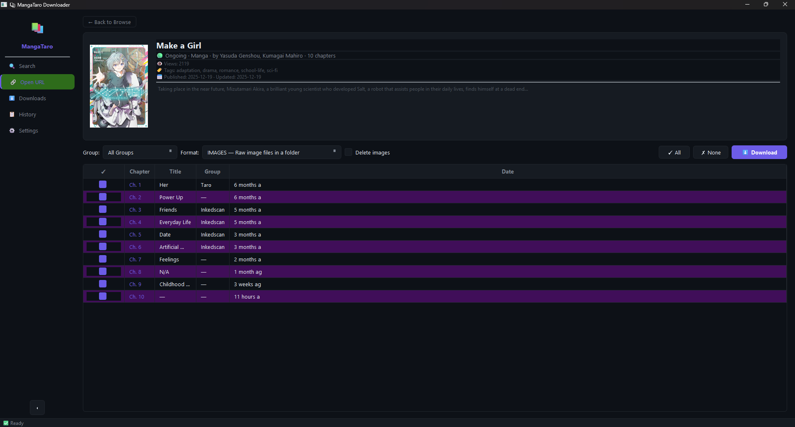

# 📚 MangaTaro Downloader

[](https://python.org)
[](https://www.riverbankcomputing.com/software/pyqt/)
[](https://opensource.org/licenses/MIT)
[](https://github.com/Yui007/mangataro-downloader)

A modern, fast, and feature-rich manga downloader and manager for **MangaTaro.org**. Designed for both power users who love the terminal and desktop users who prefer a sleek, premium GUI.

---

## 🎨 Interface Showcase

### Desktop GUI
Launch the application with `mangataro-gui` to enjoy a gorgeous dark-themed dashboard. Track individual chapter download progress in real-time, browse covers instantly, and manage your queue visually:



---

## ✨ Features

- 🖥️ **Desktop GUI**: Built with PyQt6, featuring a modern dark theme, cover loading, and individual chapter download bars.
- 🐚 **Interactive Shell**: A rich, menu-driven CLI interface for guided downloads without remembering commands.
- ⚡ **Direct CLI Commands**: Fast, automated commands for searching, querying info, and scriptable bulk downloading.
- 🚀 **High Concurrency**: Multi-threaded downloader fetches chapter pages concurrently to saturate connection speed.
- 📦 **Multiple Formats**: Export manga to high-quality formats:
  - **CBZ** (Comic Book Zip archive)
  - **PDF** (Portable Document Format)
  - **WEBP** (Optimized web image format)
  - **Images** (Plain PNG/WebP files)
- 📋 **History & Auto-resuming**: Keeps track of what you've downloaded to prevent duplicates.

---

## ⚙️ Installation

### Method 1: standard Installation
Clone the repository and install the package with GUI support:
```bash
git clone https://github.com/Yui007/mangataro-downloader.git
cd mangataro-downloader
pip install ".[gui]"
```

### Method 2: Development / Editable Setup
If you want to modify the source code, install in editable mode:
```bash
git clone https://github.com/Yui007/mangataro-downloader.git
cd mangataro-downloader
pip install -e ".[gui]"
```

### Method 3: Using `uv` (Ultra-fast)
If you use the modern Python package manager [uv](https://github.com/astral-sh/uv), you can install or run directly:
```bash
# Install package
uv pip install -e ".[gui]"

# Or run commands directly without explicit installation
uv run mangataro-gui
uv run mangataro interactive
```

---

## 🚀 Usage Guide

The downloader offers **three different interfaces** depending on your preference.

### 1. Graphical User Interface (GUI)
Simply run the GUI launcher command:
```bash
mangataro-gui
```
*Alternatively, run as a module: `python -m mangataro.gui`*

### 2. Interactive CLI Shell
Ideal for downloading inside the terminal without typing long arguments. Runs a beautiful terminal application with keyboard selection:
```bash
mangataro interactive
```
*Alternatively, run as a module: `python -m mangataro cli interactive`*

### 3. Direct CLI Commands
Perfect for quick scripts and automation.

#### 🔍 Search Manga
Find manga titles and fetch their URL slugs:
```bash
mangataro search "Solo Leveling"
```

#### 📖 Get Manga Details
Inspect metadata, description, publication info, and available chapters:
```bash
mangataro info solo-leveling
```

#### ⬇️ Download Chapters
Download specific chapters with customization:
```bash
# Download chapters 1 to 5 as CBZ and clean up raw images afterwards
mangataro download solo-leveling --chapters 1-5 --format cbz --delete

# Download a selection of specific chapters
mangataro download solo-leveling --chapters 1,5,10-12 --format pdf

# Download all available chapters
mangataro download solo-leveling --chapters all
```

#### 📋 Download History
Display a log of your completed downloads:
```bash
mangataro history
```

#### ⚙️ Configuration & Settings
View and change downloader settings (e.g. output directory, concurrency, formats):
```bash
# View current configuration
mangataro settings --show

# Change download destination folder
mangataro settings --set output_dir --value "D:/Manga"

# Change default output format
mangataro settings --set default_format --value "cbz"
```

---

## 🛡️ License

Distributed under the **MIT License**. See `LICENSE` for details.

Developed with ❤️ by [xYui](https://github.com/Yui007/mangataro-downloader).
